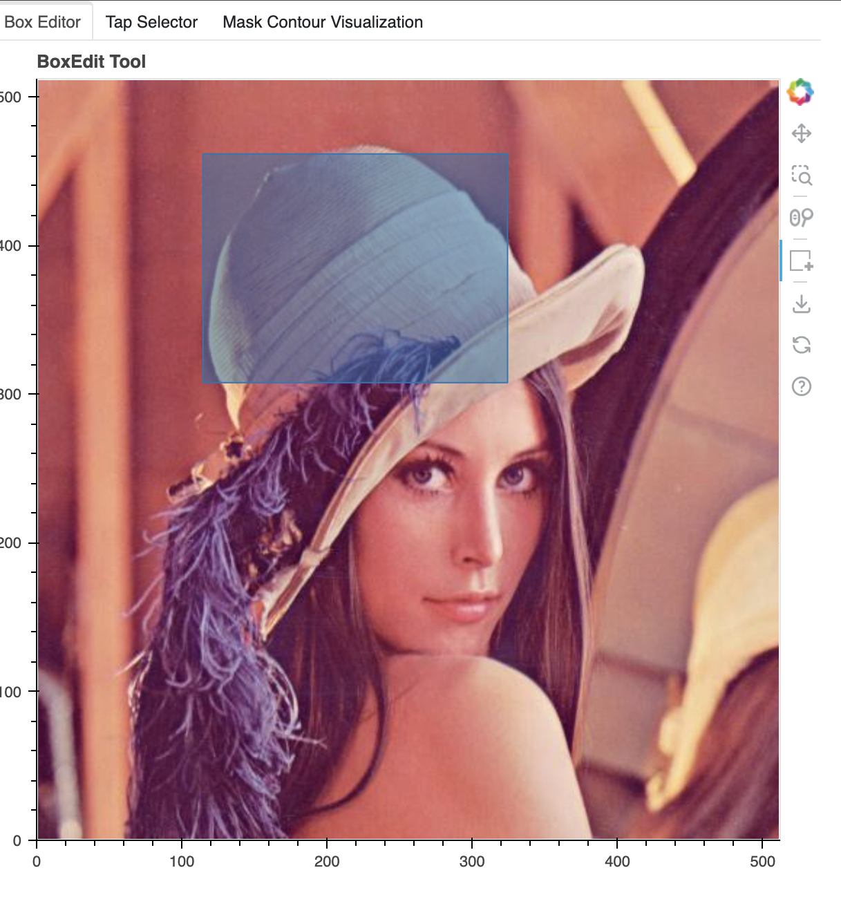

## Interactive Segment Anything for Python starter

This repository provides a simple interactive interface for [Segment Anything](https://github.com/facebookresearch/segment-anything), allowing click based interaction using Python.

Most existing starter code for testing SAM uses static code, while most GenAI/generative image and video editing applications need more dynamic approaches. This repository is a starter for building such applications (e.g., image editing tools) for mostly developers, AI engineers, machine learning researchers and data scientists. 

Initially, I intended this to work completely within the Jupyter Notebook, however quickly realized Jupyter is not great for interactive graphical applications. In searching, I found `bokeh` to be a good option, which starts a web server that can run Python code.

### Entry point.

- `sam_w_clicks.ipynb` presents all the functionality
- Each module is separated for easier editing. 
- Tip: If your port is rejected, you may want to modify the default port:
```python
multi_tab_visualizer = MultiToolVisualizer(raw_image, automatic_mask_outputs["masks"], resize=1, port=5003)
```

### Functionality.

There are three modes for selecting regions for segmentation.

#### A. Box region selection

- Draw a rectangular box to select a region of interest.
- Samples points inside rectangular box using a Gaussian distribution -> I experimented a bit and found this to work better than the built-in box selection method SAM provides.




#### B. Tap point selection

- Click on a few key points of interest to segment out a region. 
- It works well for cases when native SAM masks are partial and clicks can resolve ambiguity (e.g., for when dealing with small, intricate objects with partial or obstructed view).


#### C. Automatic mask generation selection (via clicks)

- Allows hovering over and clicking automatically generated masks using Segment Anything's automatic mask generation pipeline.
- Top is the selection, bottom is the corresponding output (not surprisingly, they look the same).


